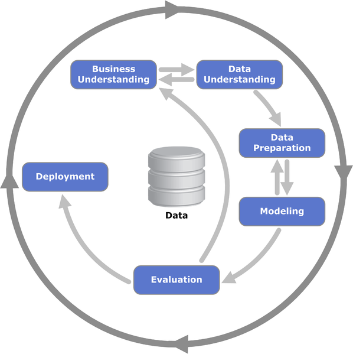

We'll loosely follow the cross-industry standard for data mining (CRISP-DM), making modifications when needed to fit the insurance use case. This will be a starting point and illustrates the iterative and cyclical nature of predictive modeling - i.e., feature engineering may influence what goes into the model, but modeling outcomes may influence feature engineering. I think we should create our own diagram, especially since data preparation and modeling has many subtasks and cycles between those subtasks.

List of stuff to do:

- Project Inception
    * Identify primary stakeholder/model buyer
    * Identify relevant staff (underwriters, IT personnel, other actuaries)
    * Determine business use case
    * Determine project scope
    * Agree on final deliverable
    * Estimate and agree on project costs
    * Prepare list of variables relevant to business case
- Data Acquisition
    * Identify data sources
    * Evaluate cost
    * Obtain access to company databases
    * Obtain data documentation
    * Obtain required connection strings
- Data Preparation
    * Evaluate data completeness
    * Identify keys
    * Join data tables, internal/external data
    * Identify granularity of observations
    * Perform data imputation
    * Eliminate irrelevant / poor quality variables
    * Feature engineering
    * Univariate analysis
    * Holdout splitting
- Modeling
    * Determine response distribution
    * Selection of algorithms to be used
    * Automated feature selection
        * Forward selection
        * Backward selection
        * Elastic Net
    * Evaluation of model fit
- Validation
    * Cross validation
    * Residual analysis
    * Assumptions testing
- Communication with stakeholders
- Adjusting the model to conform to stakeholder and legal requirements
- Model approval
- Filing
- Model Deployment